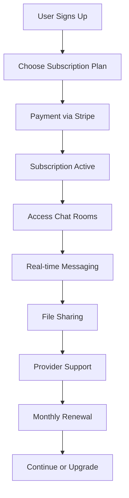
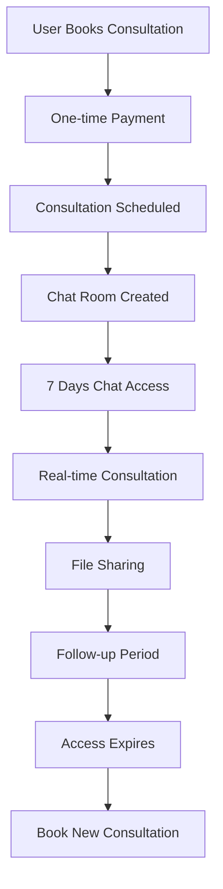

# Chat System Integration with Subscriptions & One-Time Appointments

## Overview

The SmartTelehealth chat system is designed to seamlessly integrate with both subscription-based and one-time appointment models. This document explains how the chat functionality works within your healthcare platform's business model.

## Business Model Integration

### 1. Subscription-Based Chat Access

#### **Subscription Plans & Chat Limits**
```json
{
  "Basic Health Plan": {
    "MonthlyPrice": 29.99,
    "ConsultationLimit": 2,
    "MessagingCount": 10, // Limited messages per month
    "IncludesChat": true,
    "ChatFeatures": ["Basic messaging", "File sharing", "Provider support"]
  },
  "Premium Health Plan": {
    "MonthlyPrice": 49.99,
    "ConsultationLimit": 5,
    "MessagingCount": -1, // Unlimited messages
    "IncludesChat": true,
    "ChatFeatures": ["Unlimited messaging", "Priority support", "File sharing", "24/7 access"]
  },
  "Family Health Plan": {
    "MonthlyPrice": 79.99,
    "ConsultationLimit": 10,
    "MessagingCount": -1, // Unlimited messages
    "IncludesChat": true,
    "ChatFeatures": ["Family chat rooms", "Unlimited messaging", "Pediatric support"]
  }
}
```

#### **Chat Room Types Based on Subscription**

| Chat Room Type | Subscription Required | Features |
|----------------|----------------------|----------|
| **Consultation Chat** | Active subscription OR one-time payment | Real-time consultation, file sharing, follow-up |
| **Support Chat** | Active subscription | General health questions, medication support |
| **Family Chat** | Family subscription | Multi-participant family discussions |
| **Emergency Chat** | Premium subscription | 24/7 emergency support |

### 2. One-Time Appointment Chat Access

#### **Appointment-Based Chat Rooms**
```csharp
// When creating a one-time consultation
var consultation = new Consultation
{
    Type = ConsultationType.OneTime,
    Fee = 99.99m,
    DurationMinutes = 30,
    IncludesChatAccess = true, // 7 days of chat access
    ChatAccessExpiry = DateTime.UtcNow.AddDays(7)
};
```

#### **Chat Access Duration**
- **One-time consultation**: 7 days of chat access
- **Follow-up period**: 30 days (if consultation includes follow-up)
- **Emergency consultation**: 24 hours of chat access

## Chat System Integration Architecture

### 1. Chat Room Creation Logic

```csharp
public async Task<ChatRoomDto> CreateChatRoomForConsultationAsync(Guid consultationId)
{
    var consultation = await _consultationRepository.GetByIdAsync(consultationId);
    
    // Determine chat room type based on consultation
    var chatRoomType = consultation.SubscriptionId.HasValue 
        ? ChatRoom.ChatRoomType.Subscription 
        : ChatRoom.ChatRoomType.OneTime;
    
    // Set access permissions based on subscription/consultation
    var accessExpiry = consultation.SubscriptionId.HasValue
        ? null // No expiry for subscription
        : consultation.ChatAccessExpiry; // Limited access for one-time
    
    var chatRoom = new ChatRoom
    {
        Name = $"Consultation - {consultation.Category.Name}",
        Type = chatRoomType,
        ConsultationId = consultationId,
        SubscriptionId = consultation.SubscriptionId,
        AccessExpiry = accessExpiry,
        IsGroupChat = false
    };
    
    return await _chatRoomService.CreateChatRoomAsync(chatRoom);
}
```

### 2. Message Limit Enforcement

```csharp
public async Task<ApiResponse<MessageDto>> SendMessageWithLimitCheckAsync(CreateMessageDto createDto)
{
    var user = await _userRepository.GetByIdAsync(createDto.SenderId);
    var chatRoom = await _chatRoomRepository.GetByIdAsync(createDto.ChatRoomId);
    
    // Check subscription limits
    if (chatRoom.SubscriptionId.HasValue)
    {
        var subscription = await _subscriptionRepository.GetByIdAsync(chatRoom.SubscriptionId.Value);
        var messageCount = await _messageRepository.GetUserMessageCountAsync(user.Id, subscription.Id);
        
        if (subscription.MessagingCount > 0 && messageCount >= subscription.MessagingCount)
        {
            return ApiResponse<MessageDto>.ErrorResponse(
                "Message limit reached for this month. Upgrade your subscription for unlimited messaging.", 
                403);
        }
    }
    
    // Check one-time consultation expiry
    if (chatRoom.AccessExpiry.HasValue && DateTime.UtcNow > chatRoom.AccessExpiry.Value)
    {
        return ApiResponse<MessageDto>.ErrorResponse(
            "Chat access has expired. Schedule a new consultation to continue messaging.", 
            403);
    }
    
    return await _messageService.CreateMessageAsync(createDto);
}
```

### 3. Real-Time Notifications Based on Subscription

```csharp
public async Task SendSubscriptionBasedNotificationAsync(Guid userId, string notificationType)
{
    var user = await _userRepository.GetByIdAsync(userId);
    var activeSubscription = await _subscriptionRepository.GetActiveSubscriptionAsync(userId);
    
    if (activeSubscription != null)
    {
        // Premium subscribers get immediate notifications
        if (activeSubscription.Plan.IncludesPrioritySupport)
        {
            await _notificationService.SendImmediateNotificationAsync(userId, notificationType);
        }
        else
        {
            // Basic subscribers get delayed notifications
            await _notificationService.SendDelayedNotificationAsync(userId, notificationType, TimeSpan.FromMinutes(5));
        }
    }
    else
    {
        // One-time consultation users get basic notifications
        await _notificationService.SendBasicNotificationAsync(userId, notificationType);
    }
}
```

## User Experience Flow

### 1. Subscription User Journey



### 2. One-Time Consultation User Journey



## Chat Features by Subscription Level

### Basic Health Plan ($29.99/month)
- ✅ **2 consultations per month**
- ✅ **10 messages per month**
- ✅ **Basic file sharing** (images, documents)
- ✅ **Email support**
- ❌ **No priority support**
- ❌ **No 24/7 access**

### Premium Health Plan ($49.99/month)
- ✅ **5 consultations per month**
- ✅ **Unlimited messaging**
- ✅ **Advanced file sharing** (videos, large files)
- ✅ **Priority support**
- ✅ **24/7 chat access**
- ✅ **Prescription delivery chat**
- ✅ **Real-time notifications**

### Family Health Plan ($79.99/month)
- ✅ **10 consultations per month**
- ✅ **Unlimited messaging**
- ✅ **Family chat rooms**
- ✅ **Pediatric care chat**
- ✅ **Mental health support**
- ✅ **Multi-participant conversations**
- ✅ **Family file sharing**

## One-Time Consultation Features

### Standard Consultation ($99.99)
- ✅ **30-minute consultation**
- ✅ **7 days chat access**
- ✅ **File sharing during consultation**
- ✅ **Follow-up messaging**
- ❌ **No ongoing support**

### Emergency Consultation ($149.99)
- ✅ **Immediate consultation**
- ✅ **24 hours chat access**
- ✅ **Priority provider assignment**
- ✅ **Emergency file sharing**
- ✅ **Urgent care support**

## Technical Implementation

### 1. Database Relationships

```sql
-- Chat rooms linked to subscriptions or consultations
CREATE TABLE ChatRooms (
    Id UNIQUEIDENTIFIER PRIMARY KEY,
    Name NVARCHAR(100),
    Type INT, -- 1=Subscription, 2=OneTime, 3=Support
    SubscriptionId UNIQUEIDENTIFIER NULL,
    ConsultationId UNIQUEIDENTIFIER NULL,
    AccessExpiry DATETIME2 NULL,
    IsActive BIT DEFAULT 1
);

-- Message limits tracking
CREATE TABLE MessageUsage (
    Id UNIQUEIDENTIFIER PRIMARY KEY,
    UserId UNIQUEIDENTIFIER,
    SubscriptionId UNIQUEIDENTIFIER,
    MonthYear NVARCHAR(7), -- YYYY-MM format
    MessageCount INT DEFAULT 0,
    LastMessageDate DATETIME2
);
```

### 2. API Endpoints

```csharp
// Subscription-based chat access
[HttpPost("api/chat/rooms/subscription")]
public async Task<ApiResponse<ChatRoomDto>> CreateSubscriptionChatRoomAsync(CreateSubscriptionChatRoomDto dto)

// One-time consultation chat access
[HttpPost("api/chat/rooms/consultation")]
public async Task<ApiResponse<ChatRoomDto>> CreateConsultationChatRoomAsync(CreateConsultationChatRoomDto dto)

// Message limit checking
[HttpGet("api/chat/usage/{subscriptionId}")]
public async Task<ApiResponse<MessageUsageDto>> GetMessageUsageAsync(Guid subscriptionId)

// Upgrade subscription
[HttpPost("api/subscriptions/{id}/upgrade")]
public async Task<ApiResponse<SubscriptionDto>> UpgradeSubscriptionAsync(Guid id, UpgradeSubscriptionDto dto)
```

### 3. Real-Time Integration

```csharp
// SignalR hub with subscription awareness
public class ChatHub : Hub
{
    public async Task SendMessage(string chatRoomId, string message)
    {
        var user = await GetCurrentUserAsync();
        var chatRoom = await _chatRoomService.GetChatRoomAsync(chatRoomId);
        
        // Check subscription limits
        if (!await _subscriptionService.CanSendMessageAsync(user.Id, chatRoom.SubscriptionId))
        {
            await Clients.Caller.SendAsync("MessageLimitReached", "Upgrade your subscription for unlimited messaging");
            return;
        }
        
        // Send message and update usage
        await _messageService.SendMessageAsync(chatRoomId, user.Id, message);
        await _subscriptionService.IncrementMessageUsageAsync(user.Id, chatRoom.SubscriptionId);
    }
}
```

## Billing Integration

### 1. Subscription Billing
- **Monthly/Annual billing** via Stripe
- **Usage-based billing** for message limits
- **Upgrade/downgrade** subscription plans
- **Pause/resume** subscription functionality

### 2. One-Time Consultation Billing
- **Immediate payment** for consultation
- **Chat access included** in consultation fee
- **Extended chat access** available for additional fee
- **Follow-up consultation** booking

## Security & Compliance

### 1. Access Control
- **Subscription validation** before chat access
- **Expiry date enforcement** for one-time consultations
- **Role-based permissions** (Patient, Provider, Admin)
- **Audit logging** for all chat activities

### 2. Data Protection
- **End-to-end encryption** for messages
- **Secure file storage** with access controls
- **HIPAA compliance** for healthcare data
- **Data retention policies** based on subscription type

## Monitoring & Analytics

### 1. Usage Tracking
```csharp
public class ChatAnalyticsService
{
    public async Task<ChatUsageDto> GetSubscriptionUsageAsync(Guid subscriptionId)
    {
        return new ChatUsageDto
        {
            MessagesSent = await _messageRepository.GetMessageCountAsync(subscriptionId),
            FilesShared = await _fileRepository.GetFileCountAsync(subscriptionId),
            ActiveChatRooms = await _chatRoomRepository.GetActiveRoomCountAsync(subscriptionId),
            AverageResponseTime = await _messageRepository.GetAverageResponseTimeAsync(subscriptionId)
        };
    }
}
```

### 2. Business Metrics
- **Subscription conversion rates**
- **Chat engagement metrics**
- **Message limit utilization**
- **Upgrade/downgrade patterns**
- **One-time to subscription conversion**

## Conclusion

The SmartTelehealth chat system provides a flexible, subscription-aware messaging platform that supports both recurring subscription models and one-time consultation services. The integration ensures:

- ✅ **Seamless user experience** across subscription levels
- ✅ **Flexible billing models** (subscription + one-time)
- ✅ **Real-time communication** with appropriate limits
- ✅ **Scalable architecture** for healthcare applications
- ✅ **Compliance-ready** for healthcare data protection

This architecture allows your platform to serve both subscription-based patients seeking ongoing care and one-time patients requiring immediate consultation, all while maintaining appropriate access controls and billing integration. 